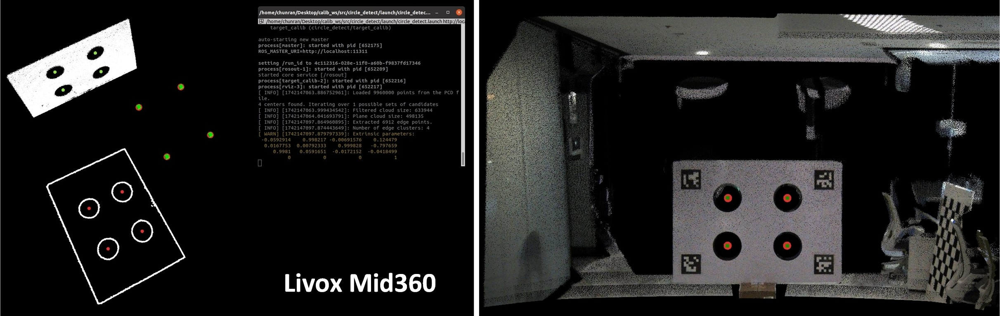
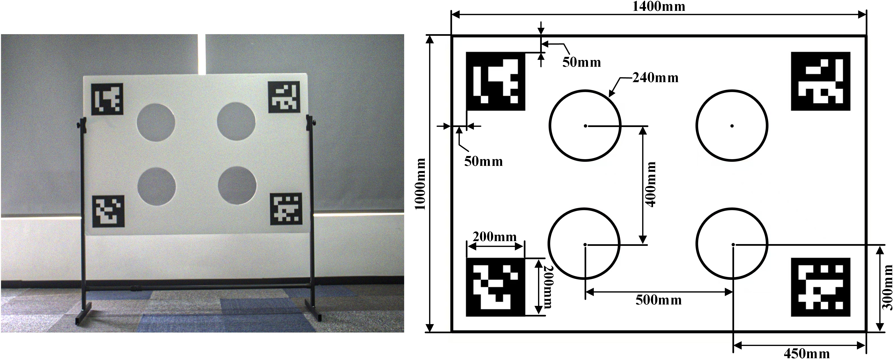
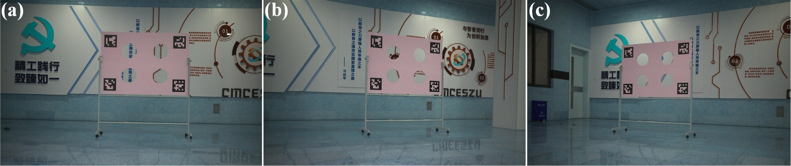

# FAST-Calib

LiDAR와 카메라 사이의 외부 파라미터를 캘리브레이션하기 위한 ROS 기반 FAST-Calib 패키지입니다.  
ArUco/QR 마커와 원형 홀이 있는 타겟을 사용해 이미지에서 타겟 기준점을 찾고, LiDAR 포인트클라우드에서 대응되는 홀 중심점을 검출한 뒤 `T_cam_lidar` 변환을 계산합니다.

원본 프로젝트: [FAST-Calib: LiDAR-Camera Extrinsic Calibration in One Second](https://www.arxiv.org/pdf/2507.17210)

## 주요 기능

- Livox 계열 solid-state LiDAR와 일반 mechanical LiDAR 포인트클라우드 처리
- 단일 scene 기반 LiDAR-camera 외부 파라미터 추정
- 여러 scene의 기준점 기록을 이용한 multi-scene joint calibration
- RViz 시각화 및 결과 파일 저장
- rosbag에서 이미지와 LiDAR 데이터를 추출하는 보조 스크립트 포함

## 저장소 구성

```text
FAST-Calib/
├── config/qr_params.yaml              # 카메라 내부 파라미터, 타겟 치수, 필터 범위, 입력/출력 경로
├── launch/calib.launch                # 단일 scene 캘리브레이션 실행
├── launch/multi_calib.launch          # multi-scene 캘리브레이션 실행
├── src/main.cpp                       # 단일 scene 캘리브레이션 노드
├── src/multi_scene.cpp                # multi-scene 캘리브레이션 노드
├── scripts/distance_filter_tool.py    # LiDAR 거리 필터 설정 보조 도구
├── calib_data/                        # 사용자 캘리브레이션 데이터
├── fastcalib_scenes/                  # 예제 scene 데이터
├── output/                            # 검출/캘리브레이션 결과
└── pics/                              # README 및 workflow 이미지
```

## 환경

- Ubuntu + ROS 1 catkin workspace
- CMake 3.0.2 이상
- PCL 1.10 이상
- OpenCV
- `roscpp`, `sensor_msgs`, `pcl_ros`, `pcl_conversions`, `geometry_msgs`
- Livox 데이터를 사용할 경우 `livox_ros_driver`

## 빌드

패키지를 catkin workspace의 `src` 아래에 둔 뒤 빌드합니다.

```bash
cd /catkin_ws/src
git clone git@github.com:qwertyBBeers/FAST-Calib.git
cd /catkin_ws
catkin_make
source devel/setup.bash
```

이미 이 저장소가 `/catkin_ws/src/FAST-Calib`에 있다면 clone 단계는 생략하고 `catkin_make`부터 실행하면 됩니다.

## 데이터 준비

단일 scene 캘리브레이션에는 다음 두 파일이 필요합니다.

- LiDAR 포인트클라우드가 들어 있는 rosbag
- 같은 scene에서 촬영한 이미지

현재 설정 파일은 아래 입력을 사용하도록 되어 있습니다.

```yaml
bag_path: "/catkin_ws/src/FAST-Calib/calib_data/fastcalib_scenes/ros2_bagfile.bag"
image_path: "/catkin_ws/src/FAST-Calib/calib_data/fastcalib_scenes/ros2_bagfile.png"
lidar_topic: "/livox/lidar"
```

다른 데이터를 사용할 경우 [config/qr_params.yaml](config/qr_params.yaml)의 `bag_path`, `image_path`, `lidar_topic`을 실제 경로와 토픽명에 맞게 수정합니다.

## 파라미터 설정

[config/qr_params.yaml](config/qr_params.yaml)에서 다음 값을 확인합니다.

- `fx`, `fy`, `cx`, `cy`: 카메라 내부 파라미터
- `k1`, `k2`, `p1`, `p2`: 왜곡 계수
- `marker_size`: ArUco 마커 한 변 길이
- `delta_width_qr_center`, `delta_height_qr_center`: 마커 중심 간격
- `delta_width_circles`, `delta_height_circles`, `circle_radius`: 원형 홀 타겟 치수
- `x_min`, `x_max`, `y_min`, `y_max`, `z_min`, `z_max`: LiDAR 포인트클라우드 거리 필터
- `output_path`: 결과 저장 경로

거리 필터 값이 맞지 않으면 타겟 외부 포인트가 많이 포함되거나 타겟이 잘려 검출이 실패할 수 있습니다.

## 단일 Scene 캘리브레이션

```bash
source /catkin_ws/devel/setup.bash
roslaunch fast_calib calib.launch
```

실행 후 주요 결과는 `output/` 아래에 저장됩니다.

- `single_calib_result.txt`: 단일 scene 캘리브레이션 결과
- `circle_center_record.txt`: LiDAR/QR 타겟 중심점 기록
- `qr_detect.png`: 이미지에서 검출된 QR/타겟 결과
- `colored_cloud.pcd`: 캘리브레이션 결과로 색상이 입혀진 포인트클라우드

RViz에서는 필터링된 포인트클라우드, 평면, 엣지, 타겟 중심점, 정렬 결과를 확인할 수 있습니다.

## Multi-scene 캘리브레이션

최소 3개 이상의 서로 다른 scene에서 단일 scene 캘리브레이션을 실행해 `output/circle_center_record.txt`에 기준점 기록을 누적합니다.

그 다음 multi-scene 캘리브레이션을 실행합니다.

```bash
source /catkin_ws/devel/setup.bash
roslaunch fast_calib multi_calib.launch
```

결과는 `output/multi_calib_result.txt`에 저장됩니다.

## rosbag에서 이미지/LiDAR Pair 추출

[calib_data/extract_lidar_pair.py](calib_data/extract_lidar_pair.py)는 하나의 rosbag에서 지정한 이미지 토픽과 LiDAR 토픽을 읽어, 선택된 이미지와 시간적으로 가까운 LiDAR 메시지를 별도 bag으로 저장하는 보조 스크립트입니다.

스크립트 상단의 값을 실제 환경에 맞게 수정한 뒤 실행합니다.

```bash
python calib_data/extract_lidar_pair.py
```

주요 설정값:

- `BAG_PATH`
- `OUT_DIR`
- `IMAGE_TOPIC`
- `LIDAR_TOPIC`

## 거리 필터 보조 도구

LiDAR 타겟 영역의 대략적인 필터 범위를 잡을 때 다음 스크립트를 사용할 수 있습니다.

```bash
python scripts/distance_filter_tool.py /path/to/data.bag /path/to/output_dir
```

bag 안의 LiDAR 메시지 타입을 자동으로 확인하고 PCD 변환 및 필터 설정에 필요한 정보를 확인하는 용도입니다.

## 참고 이미지

<p align="center">
  
</p>

<p align="center">
  
</p>

<p align="center">
  
</p>

## 라이선스 및 출처

이 프로젝트는 원본 FAST-Calib 코드를 기반으로 정리한 저장소입니다.  
캘리브레이션 타겟 설계는 [velo2cam_calibration](https://github.com/beltransen/velo2cam_calibration)을 참고합니다.
